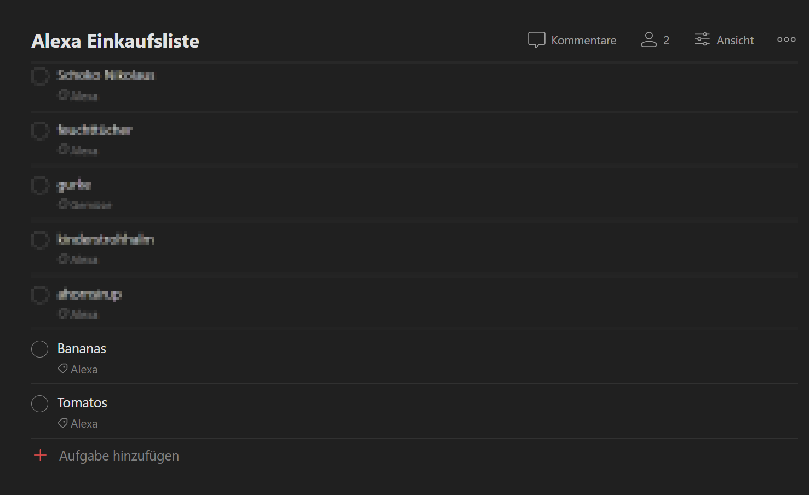
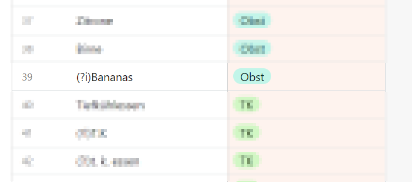
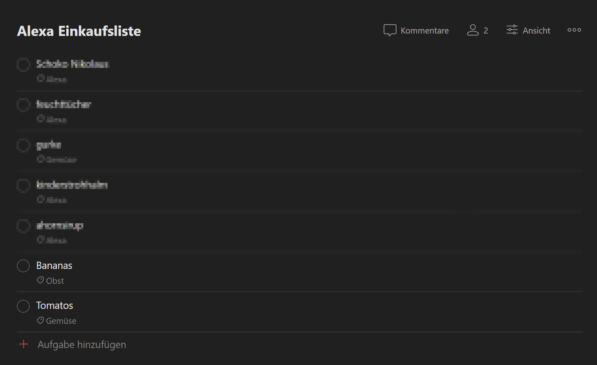

# Todoist Auto-Labeler 
At home my wife and I are using our Alexa devices to manage our grocery lists. After Wunderlist shut down we switched to Todoist since it offers a pretty good integration with Amazon Alexa.

However we are missing one feature: The automatic categorization of entries for a better shopping experience. I want my fruits, vegetables and beverages to be sorted so that I can optimize my shopping experience.

After some research - I did not find any Todo-App that is able to automatically add keywords based on your entries.

I finally had a new idea for a side-project. I decided to implement it in Rust. The only reason for doing this in Rust was really just learning it. I could have probably written this in dotnet or python a lot faster.


# What does it do?
Let's say you have a Todoist-List with entries that look like this: Bananas and Tomatos were added via an Alexa integration thus having the label "Alexa". We want them to have the label "Fruits" instead.




You define your input keyword-label combinations within an Airtable. You have to use Regex definitions. Todist Auto-Labeler will try to match those Keywords with your Todoist-Entries.



It will match Bananas and first remove the label "Alexa" and then add the label "Obst" (German for fruits) to it.



## Prerequisites
You will need
  * An Airtable account with a simple table that looks like this
```
+-------------+-----------+
|   Keyword   |   Label   |
+-------------+-----------+
| (?i)Tomato  | Fruits    |
| (?i)Bananas | Fruits    |
| Beer        | Beverages |
+-------------+-----------+
```
(You can use Rust flavored Regex in your Keyword matches! Checkout https://rustexp.lpil.uk/ for examples)

* A Todoist list and developer app which you can create here https://developer.todoist.com/appconsole.html

## How to build
Setup the Rust toolchain https://www.rust-lang.org/tools/install and run cargo build --release

## How to run
You will need a bunch of environment variables to be set or save a file with the filename **.env** file in the folder where the compiled program is located. See [env.example](/.env.example) for the keys needed.
